<p align="center">
  
</p>
<div align="center">
  
  **NUS Orbital 2026**
  
  **Milestone \#1 README**
  
  Brian Chua Peng Shuen
  
  Ian Wong Wei Jie
  
  Team ID: 6897
</div>

# **Team Name**

GoldGoldGold

# **Targeted Level of Achievement**

Apollo 11

# **Problem Motivation**

Many Singaporean males are required to complete the Individual Physical Proficiency Test (IPPT) as part of their National Service (NS) journey. Excelling in the static stations of IPPT, which includes push-ups and sit-ups, depends not only on physical fitness but also on one’s ability to perform each repetition according to strict standards enforced by ELISS machines.

A common challenge faced by NSFs/NSMen when training for the static stations on their own, is the inability to accurately determine whether repetitions done meet the standards of the ELISS machines. Without feedback on their form, NSFs/NSMen training may unknowingly develop improper form, resulting in a difference between training performance and the actual IPPT performance.

To overcome this issue, we propose a computer vision-based exercise monitoring system that tracks body landmarks in real time. By analyzing pose data, the system can evaluate exercise form (for both push-ups and sit-ups), count valid repetitions, and provide corrective feedback when standards are not met. This solution serves as a personal IPPT training assistant, enabling NSFs/NSMen to practice more effectively and reliably, helping them build confidence in excelling the static stations for IPPT.

# **Aim**

We hope to emulate ELISS machine standards to help NSFs and NSMen in training for the static stations and get one step closer to IPPT gold.

# **User Stories**

1. As an NSF/NSMan preparing for IPPT, I want the system to count my push-up repetitions in real time so that I can verify that each repetition meets the required standard.  
2. As an NSF/NSMan preparing for IPPT, I want the system to count my sit-up repetitions in real time so that I can verify that each repetition meets the required standard.  
3. As an NSF/NSMan seeking to improve my form for the static stations of IPPT, I want to receive immediate visual/textual feedback when my posture or movement is incorrect so that I can make corrections during training.  
4. As an NSF/NSMan monitoring my fitness progress, I want to access my workout statistics and historical performance data through a dashboard so that I can track improvements and identify areas that require further practice.  
5. As an NSF/NSMan training independently, I want the system to integrate live webcam tracking with an interactive dashboard so that I can perform IPPT statics training conveniently without the need for additional hardware

# **Features**

### User Authentication:

<p align="center">
  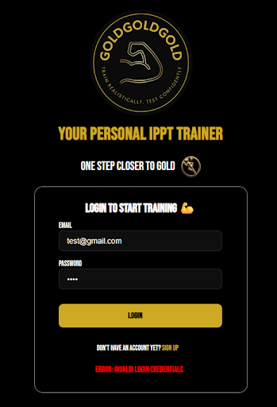
  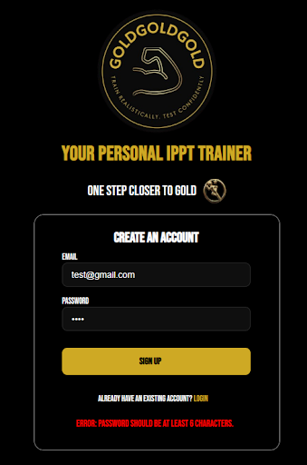
</p>
<p align="center">
  
  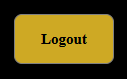
</p>

Users can create an account and log in using an email address and password through Supabase Authentication. The React frontend communicates directly with Supabase via the *@supabase/supabase-js* client library to handle user authentication. 

Upon successful authentication, users are redirected to our web app’s main page. Unauthenticated users are restricted to the login page and are prevented from accessing the route to the main page. Session validation mechanisms are implemented to ensure only authenticated users can access the main page of the web app.

### Webcam Feed & Pose Detection:

<p align="center">
  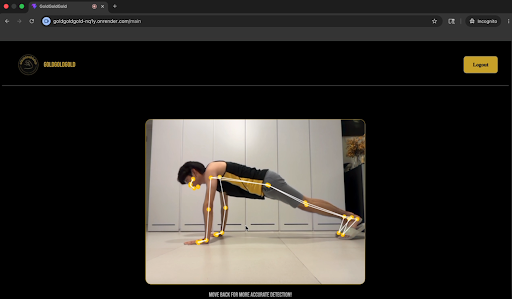
</p>
The system captures the user's webcam feed and performs real-time body pose detection using the *@mediapipe/tasks-vision* client library. Detected body landmarks are rendered as a skeletal overlay on the video stream, with gold landmarks connected by white lines to provide a clear visual representation of the user's movements and posture.

MediaPipe operates entirely within the browser, allowing all pose detection to be performed locally without streaming the user's video feed to a server. The *pose\_landmarker\_full* model is used to accurately track body landmarks, enabling the system to assess users' push-up and sit-up form more effectively and count valid repetitions with greater reliability during IPPT statics station training. 

### Session Data Pipeline:

<p align="center">
  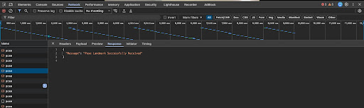
</p>
After each pose detection frame, landmark data and the user's email are sent from the React frontend to the Flask backend via a POST request to the /pose endpoint. This endpoint receives pose data, processes the request and returns a response. The Flask backend then forwards this information to Supabase, where a new record is created containing the user ID, email, landmark data, and timestamp in the userprofiles table.  
This establishes the pipeline of how we store users’ session data: User logs in → Webcam starts → Landmarks detected → Data sent to Flask backend server → Data forwarded and stored in Supabase under that corresponding user. 

### calculateAngle(pointA, pointB, pointC) function:

The `calculateAngle` function takes in 3 landmarks (`pointA`, `pointB`, `pointC`) as arguments, and outputs the interior angle formed at the second landmark, that is, `pointB` as the vertex. This means that `pointB` is treated as the joint (like the elbow, knee, hip, etc.).

To achieve this, we use the mathematical concept of vectors. Specifically, the dot product of two vectors, given by the equation:

```math
\overrightarrow{BA}\cdot\overrightarrow{BC}
=
\left|\overrightarrow{BA}\right|
\left|\overrightarrow{BC}\right|
\cos\theta
```
where $\theta$ is our desired angle.

Rearranging, we get:
```math
\cos\theta
=
\frac{
\overrightarrow{BA}\cdot\overrightarrow{BC}
}{
\left|\overrightarrow{BA}\right|
\left|\overrightarrow{BC}\right|
}
```

Since it is possible for a vector to have a magnitude of $0$, the angle is undefined because the denominator is $0$ and an error is thrown.

Furthermore, due to floating-point precision errors, the computed value of $\cos\theta$ may be slightly outside the valid range $[-1, 1]$, which would cause $\arccos$ to return `NaN` (Not a Number). To prevent this, we perform clamping to restrict the value to indeed be in the interval $[-1, 1]$:

$$
\max(-1,\min(1,\cos\theta))
$$

Applying $\arccos$ to this clamped value will return $\theta$ in radians, which is then converted to degrees by multiplying by:

$$
\frac{180}{\pi}
$$

Note that this function is yet to be utilised as of Milestone \#1. However, it is of paramount importance for the push-up counter and sit-up counter proposed for Milestone \#2.

### Push-up Rep Counter \[Proposed For Milestone \#2\]:

The system will detect push-up movements by tracking the angle of the user’s elbows and hips. There will be two set states and angle thresholds encoded in the logic of our system, namely an ‘up’ state when the user is at the top of the push-up, and a ‘down’ state when the user is at the bottom of the push-up. If the rep meets the stipulated requirements (from ‘up’ state → ‘down’ state → ‘up’ state), it will be counted as a successful rep.

### Sit-up Rep Counter \[Proposed For Milestone \#2\]:

The system will detect sit-up movements by tracking the angle of the user’s hips. There will be two set states and angle thresholds encoded in the logic of our system, namely an ‘up’ state when the user is at the top of the sit-up, and a ‘down’ state when the user is at the bottom of the sit-up. If the rep meets the stipulated requirements (from ‘down’ state → ‘up’ state → ‘down’ state), it will be counted as a successful rep.

### Workout Dashboard \[Proposed For Milestone \#2\]:

A web dashboard will display the workout statistics of the user when they completed the exercise, which includes exercise type (push-up or sit-up), final successful rep count, and final unsuccessful rep count.

### Exercise Form Feedback \[Proposed For Milestone \#3\]:

When improper form is detected, feedback messages will be displayed to inform the user. For example, if the user is not going down low enough on a push-up, or not lying flat on their back at the bottom of a sit-up, among other incorrect postures. With this, we aim to allow users to know what their mistake is and correct it.

### Workout History \[Proposed For Milestone \#3\]:

Past workout sessions will be displayed on the dashboard, fetched from Supabase and filtered by the logged-in user. With this, we hope that users will be able to track and monitor their progress over time.

### Video Capture \[Proposed For Milestone \#3\]:

Users will be able to save and rewatch a recording of their workout session so that they can review their performance.

# **Software Engineering Practices**

### Version Control

Branching:  
<p align="center">
  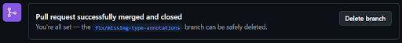
</p>
<p align="center">
  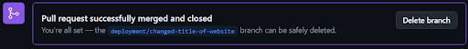
</p>
<p>
  We used Git and GitHub for version control to collaborate and manage changes to our code. Whenever we worked on new features or made any changes, we would first pull from the remote repository main branch to receive the most updated code at that point in time, and create a new branch before making the changes. Once the changes are done locally, the branch is committed and pushed back to the remote repository, and the relevant Pull Request is initiated.
</p>

Pull Requests:  
<p align="center">
  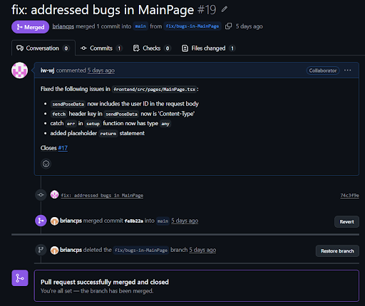
</p>
Whenever new pieces of code is finalised and pushed from our local machine to the remote repository, we will initiate a Pull Request stating the changes made and tagging the associated issue it closes. Only after the code is reviewed and merge conflicts (if any) are resolved will the merging proceed and the Pull Request be closed. The associated branch will also be deleted thereafter.

### Issues Tracking

<p align="center">
  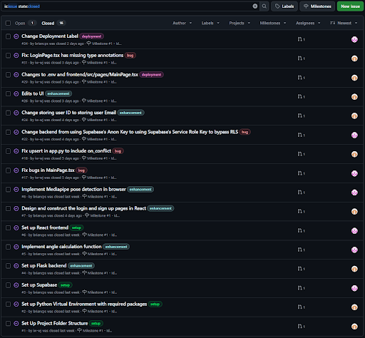
</p>
We made use of GitHub Issues to keep track of the tasks that we needed to do or rectify any bugs identified, tagging them with the appropriate labels and assigning them to whoever is tasked to complete it via assignees. Only when the associated Pull Request is reviewed and successfully merged by the partner will the issue be closed.

# 

# **Timeline and Development Plan**

### By Milestone \#1:

**Goal:**  
Implement the following:

* Using real-time webcam feed for pose detection using MediaPipe  
* Basic pose visualisation would be displayed on the screen  
* Basic webpage linked to our pose detection system  
* User authentication

**Tasks:**

1. Setup Project Folder Structure  
2. Setup Python virtual environment with required packages  
3. Setup Supabase   
   → Make *userprofiles* table to store session data for users and retrieve url, anon key and service role key	  
4. Setup Flask backend   
   → Create a file that connects to Supabase using the information stored in the .env file created in the backend folder.  
   → Create another file to ensure the Flask server has the following routes: /pose via the 'POST' method that will receive data from React and save the session data to Supabase.  
5. Implement angle calculation function  
   → Calculates the angle at the second point given the coordinates of any 3 points.  
6. Setup React frontend   
   → Create a React app using Vite that uses the React template.   
   → Set up routing as such: "/" (login page) and "/main" (main page)  
7. Design UI for login and main page  
8. Implement MediaPipe pose detection in browser  
   →Webcam access using getUserMedia  
   → Initialise Mediapipe Pose Landmarker to detect user's 33 landmarks  
   → Construct skeletal overlay over the webcam feed using the detected pose landmarks  
9. Deploy our web app  
   

**Milestone \#1 Evaluation Criteria:**

- User authentication is set up allowing users to sign up and login using their email and password  
- Live webcam feed with skeletal overlay is displayed in our Main page in the browser  
- Pose landmark data and user email is sent to Flask backend and stored in Supbase under the logged in user  
- Web app successfully deployed (accessible to users with the link)

### 

### By Milestone \#2:

**Goal:**  
Implement the following:

* Push-up detection algorithm implemented for repetition counting  
* Sit-up detection algorithm implemented for repetition counting  
* Basic web dashboard displaying exercise type, rep count and workout duration of each session

**Tasks:**

1. Rep counting logic for push-ups  
2. Rep counting logic for sit-ups  
3. Update Supabase table   
   → Add new columns for exercise\_type (text) and rep\_count (int8) to *userprofiles* table  
4. Session reset route   
   → To reset the rep counter when user starts a new session  
5. Session save route   
   → To store the completed session data (user\_email, exercise\_type, reo\_count) to Supabase when 60s timer is up, under the corresponding user   
6. Update /pose route   
   → To receive angles instead of raw pose landmark data, which returns rep\_count in response  
7. pytest tests to test functionality of rep counting logic for both push-ups and sit-ups  
8. Make new pages for PushUp and SitUp → Add /pushup and /situp route to App.tsx  
9. Add Layout component   
   → Create Layout.tsx with the navigation bar and black background (to be used in all pages except LoginPage)  
10. Exercise type selection UI   
    → Modify MainPage.tsx to show exercise type selection screen (Push-ups or Sit-ups) instead of webcam feed.  
11. 60s timer   
    → Add a 60s countdown when the user starts a push-up/sit-up session.  
12. Rep counter display   
    → Display live rep count to the user, which includes both successful and unsuccessful reps  
13. Results overlay   
    → When the 60s timer is up (session ends), the result of the session would be displayed as an overlay on the webcam feed. This overlay would display both exercise type and rep count of that session.

**Milestone \#2 Evaluation Criteria:**

- User can select to do push-ups or sit-ups at the exercise selection page (MainPage)  
- 60s timer starts the countdown when the user starts a session and ends the session when time is up.  
- Rep count updates in real time and is displayed to the user  
- Results overlay show correct rep count (both successful and unsuccessful) and exercise type when the timer ends.  
- Completed session saved to Supabase with exercise type, rep count and user email.  
- All pytest tests pass

### By Milestone \#3:

**Goal:**  
Implement the following:

* Form feedback provided based on the user’s form for each session  
* Workout performance summaries statistics displayed on the dashboard.  
* Video Capture to allow users to save and rewatch footage of past sessions to review their form.

**Tasks:**

1. Push-up form feedback  
2. Sit-up form feedback  
3. Session history route   
   → Fetch all sessions for the logged in user from Supabase  
4. pytest tests to test the functionality of form feedback and session history  
5. Form feedback UI  
    → Display real time form feedback messages on screen during the user’s session  
6. Workout history dashboard   
   → Make a history page showing all pasts sessions of the user (should display exercise type and rep count for all past sessions)  
7. History page routing   
   → Add /history route to App.tsx. Add History button to navigation bar in Layout.tsx  
8. Video capture   
   → Allow users to save a recording of their session and display these saved recordings on the history dashboard for users to playback and review  
   

**Milestone \#3 Evaluation Criteria:**

- Form feedback messages appear in real time during user’s session  
- Workout history dashboard accurately displays past sessions’ data (exercise type, rep count) for the logged in user   
- Video capture allows saving and rewatching of completed sessions  
- All pytest tests pass

# 

# **Challenges Faced**

When we were trialing our own web app by ourselves, we encountered a few problems:

1. **React was unable to POST to Flask endpoint**

<p align="center">
  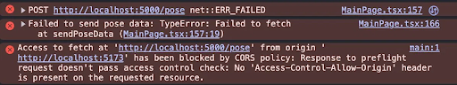
</p>
<p>
  Initially, the pose landmarks were not being sent to our Flask endpoint, resulting in the error displayed above. The both of us spent hours trying to rectify this problem, attempting different changes to the code hoping it will resolve the issue. Eventually, the fix was to turn off AirPlay Receiver in our system settings (we are both MacBook users). The reason for this is that AirPlay Receiver was using port 5000, the same port that our Flask ran on. So, when our React app tried to POST to *http://localhost:5000/pose*, it was hitting AirPlay instead of Flask. An alternative solution is to change the port used to run Flask.
</p>

2. **Email rate limit exceeded in Supabase**

<p align="center">
  
</p>
<p align="center">
  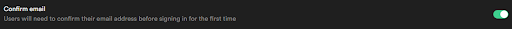
</p>
<p align="center">
  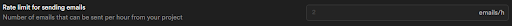
</p>
<p>
  Initially, we enabled Supabase’s authentication feature of ‘Confirm email’, where users will be required to confirm their email address before signing in for the first time. However, in our trialing, we encountered the above error, stating we had exceeded the ‘email rate limit’. And when this happened, every other new user will be unable to sign up. Since we were using the free Supabase plan, we could not change the ‘Rate limit for sending emails’. Hence, we decided to disable this feature.
</p>

3. **Unable to store session data in Supabase**
<p>
  Initially, we used Supabase’s anon key to connect to Supabase. However, we were faced with the following error due to insufficient table privileges and RLS restrictions:  
</p>
*{*  
  *"Error Message": "{'message': 'permission denied for table userprofiles', 'code': '42501', 'hint': 'Grant the required privileges to the current role with: GRANT SELECT, INSERT, UPDATE ON public.userprofiles TO anon;', 'details': None}"*  
*}*  
<p align="center">
  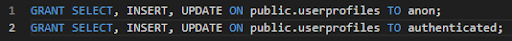
</p>
So we tried the above SQL commands, but it still did not rectify the issue.

We then switched to using Supabase’s service role key, because it bypasses RLS policies. However, table-level privileges still needed to be explicitly granted:  
*{*  
    *"Error Message": "{'message': 'permission denied for table userprofiles', 'code': '42501', 'hint': 'Grant the required privileges to the current role with: GRANT SELECT, INSERT, UPDATE ON public.userprofiles TO service\_role;', 'details': None}"*  
*}*  
<p align="center">
  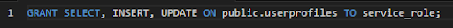
</p>
We then performed the above SQL command to finally resolve this problem.

# **Tech Stack**

Tools:

* GitHub

Frontend:

* React with Vite (implicitly uses HTML and CSS via React jsx)  
* TypeScript & JavaScript  
* MediaPipe Tasks Vision

Backend:

* Python  
* Flask

Database & Auth:

* Supabase

Deployment:

* Render

# **System Architecture Diagram**

<p align="center">
  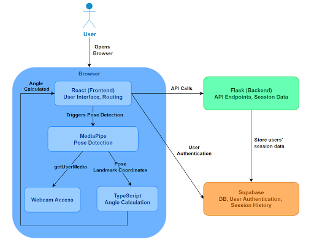
</p>

# **Relevant Links**

Deployed Website:  
[https://goldgoldgold-nq1y.onrender.com](https://goldgoldgold-nq1y.onrender.com)

Project Log:  
[https://drive.google.com/file/d/1U3cVwU6Oq9KI1WePnWb9cZGCRJVaFvC0/view?usp=drive\_link](https://drive.google.com/file/d/1U3cVwU6Oq9KI1WePnWb9cZGCRJVaFvC0/view?usp=drive_link)

Project Video:  
[https://drive.google.com/file/d/1k8kdKp7Y3dIWYRISCg1nh3WBhi4cNFxE/view?usp=drive\_link](https://drive.google.com/file/d/1k8kdKp7Y3dIWYRISCg1nh3WBhi4cNFxE/view?usp=drive_link)

Project Poster:  
[https://drive.google.com/file/d/1p\_UbGpXhP5NB9OL5BkWyh-uEJ2\_eRUsi/view?usp=drive\_link](https://drive.google.com/file/d/1p_UbGpXhP5NB9OL5BkWyh-uEJ2_eRUsi/view?usp=drive_link)  
